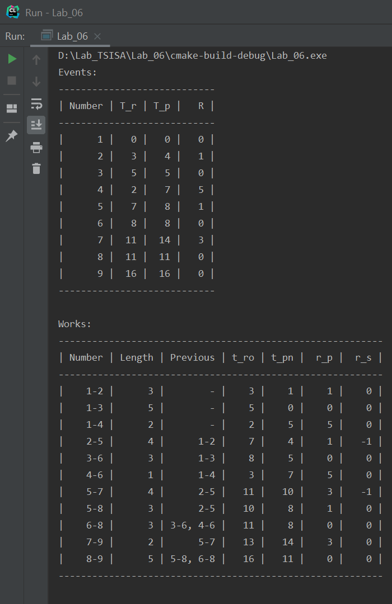
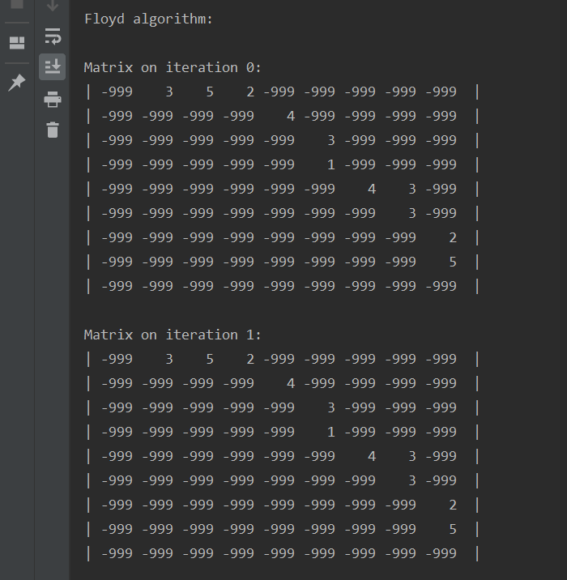
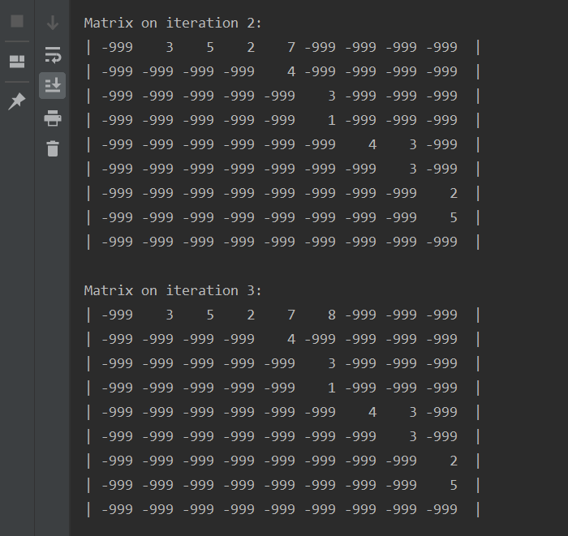
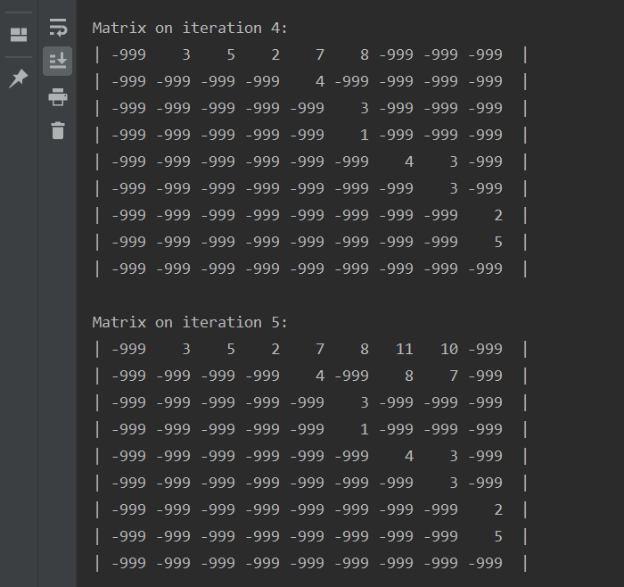
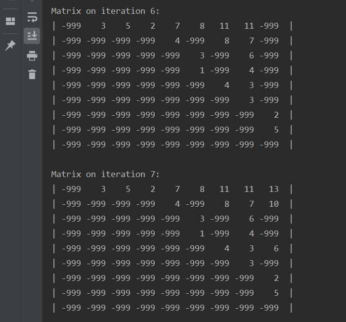
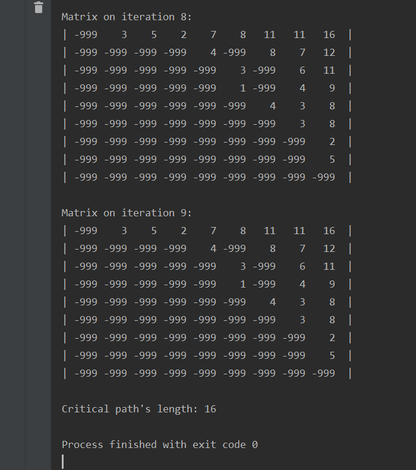

# Лабораторная работа №6 по Теории систем и системному анализу
Вариант 4
## Задание
Задан набор работ с множествами непосредственно предшествующих работ (по варианту).

1. Построить сетевой граф, произвести его топологическое упорядочение и нумерацию.
2. Рассчитать и занести в таблицу поздние сроки начала и ранние сроки окончания работ.
3. Рассчитать и занести в таблицу ранние и поздние сроки наступления событий.
4. Рассчитать полный и свободный резервы времени работ.
5. Рассчитать резерв времени событий, определить и выделить на графе критический путь.
   
## Выполнение
Код файла, реализующего расчет графа, а также представляющего результаты в виде таблиц, приведен в main.cpp

